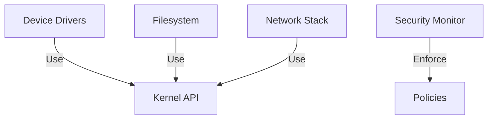

# Architecture

## Overview
SuperOS is a capability-based, microkernel operating system designed for security, reliability, and performance. The architecture enforces strict separation between policy (Python) and mechanism (Rust), with the kernel serving as the single source of truth for all system operations.

## Architectural Layers

### 1. Hardware Abstraction Layer (HAL)
```rust
trait HardwareInterface {
    fn initialize(&self) -> Result<(), Error>;
    fn read_register(&self, addr: usize) -> u32;
    fn write_register(&mut self, addr: usize, value: u32);
    fn handle_interrupt(&self, irq: u32) -> Result<(), Error>;
}
```
- Platform-agnostic hardware interfaces
- Device driver framework
- Interrupt and exception handling
- Memory-mapped I/O

### 2. Microkernel
- **Process Management**
  - Process/thread creation/destruction
  - Scheduling
  - Capability management

- **Memory Management**
  - Virtual memory
  - Page allocation
  - Memory protection

- **IPC System**
  - Message passing
  - Port management
  - Synchronization primitives

### 3. System Services


### 4. User Space
- **Application Runtime**
  - Standard library
  - Language runtimes
  - System utilities

- **Policy Layer**
  - Security policies
  - Resource management
  - Service configuration

## Capability System

### Core Concepts
```rust
struct Capability {
    id: CapabilityId,
    rights: BitSet<Right>,
    target: ResourceId,
    // Metadata for revocation and tracking
    metadata: CapabilityMeta,
}

enum Right {
    Read,
    Write,
    Execute,
    Delegate,
    // ... other rights
}
```

### Capability Operations
1. **Creation**: By privileged services only
2. **Delegation**: Transfer with possible rights reduction
3. **Revocation**: Immediate invalidation
4. **Inspection**: Query capabilities of a process

## Security Model

### Principles
1. **No Ambient Authority**
   - All access must be explicitly granted
   - No global root user
   - Principle of least privilege

2. **Capability-Based Security**
   - All resources are referenced through capabilities
   - Fine-grained access control
   - Delegation with attenuation

3. **Verification**
   - Static analysis of policies
   - Runtime checks
   - Formal verification of critical components

## Performance Considerations

### Kernel Optimizations
- Lock-free data structures
- Per-CPU caches
- Batched system calls
- Asynchronous I/O

### IPC Performance
- Zero-copy message passing
- Shared memory regions
- Priority inheritance for message queues

## Boot Process

1. **Bootloader**
   - Load kernel image
   - Initialize memory
   - Hand off to kernel

2. **Kernel Initialization**
   - Set up memory management
   - Initialize device tree
   - Start process manager

3. **User Space**
   - Start init process
   - Load system services
   - Apply security policies

## Error Handling

### Kernel Panics
- Unrecoverable errors
- Security violations
- Hardware failures

### Graceful Degradation
- Service restart
- Resource reclamation
- State checkpointing

## Implementation Guidelines

### Code Organization
```
superos/
├── kernel/           # Kernel core
├── hal/             # Hardware abstraction
├── services/        # System services
├── lib/             # Shared libraries
└── policies/        # Security policies
```

### Testing Strategy
- Unit tests for core components
- Integration tests for services
- Fuzz testing for security
- Performance benchmarking

## Future Extensions
- Live update support
- Formal verification
- Heterogeneous computing
- Energy-aware scheduling