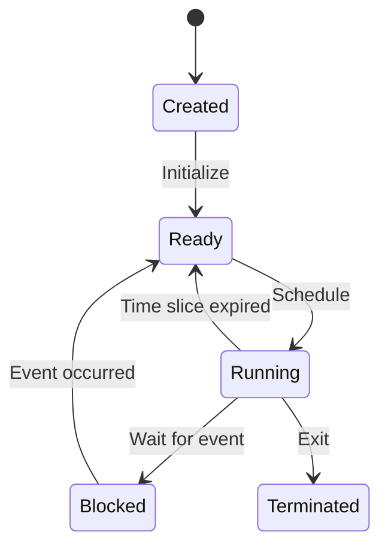

# Process Model

## Process Fundamentals

### Process Definition
A process in SuperOS is a secure, isolated execution environment with:
- Private virtual address space
- Set of capabilities
- Collection of threads
- Resource limits and accounting

### Process States


## Process Creation

### 1. Process Creation API
```rust
let process = ProcessBuilder::new("/bin/example")
    .args(["--debug"])
    .capabilities(&["network", "filesystem"])
    .spawn()?;
```

### 2. Process Hierarchy
- Strict parent-child relationships
- Capability inheritance
- Process groups and sessions

## Threading Model

### Lightweight Threads
```rust
let handle = thread::spawn(|| {
    // Thread code
    println!("Hello from thread!");
});
handle.join().unwrap();
```

### Thread Local Storage
```rust
thread_local! {
    static THREAD_STATE: RefCell<ThreadState> = 
        RefCell::new(ThreadState::new());
}
```

## Capability Management

### Capability Types
1. **Memory Capabilities**
   - Control memory access
   - Define memory regions

2. **I/O Capabilities**
   - Device access control
   - Network endpoints

3. **IPC Capabilities**
   - Communication channels
   - Port access

### Capability Transfer
```rust
// Transfer a capability to another process
let transferred = process.transfer_capability(
    "network", 
    target_process_id
)?;
```

## Process Isolation

### Address Space Layout
- Each process has isolated virtual memory
- Guard pages for stack/heap protection
- ASLR (Address Space Layout Randomization)

### System Call Filtering
```yaml
# Example policy
process:
  name: "database"
  allowed_syscalls:
    - read
    - write
    - mmap
    - munmap
  denied_syscalls:
    - execve
    - ptrace
```

## Process Lifecycle

### 1. Creation
- Allocate process control block
- Set up address space
- Initialize capabilities

### 2. Execution
- Thread scheduling
- System call handling
- Signal delivery

### 3. Termination
- Resource cleanup
- Child process reaping
- Exit status reporting

## Performance Considerations

### Process Creation
- Copy-on-write optimization
- Pre-forked worker pools
- Process templates

### Context Switching
- Fast path for common cases
- Lazy FPU state saving
- Cache-friendly data structures

## Security Features

### 1. Capability-Based Access Control
- No ambient authority
- Principle of least privilege
- Delegation with attenuation

### 2. Process Sandboxing
- Seccomp filters
- Namespace isolation
- Resource limits

### 3. Memory Safety
- Stack canaries
- W^X memory protection
- Control Flow Integrity (CFI)

## Debugging and Monitoring

### Process Inspection
```rust
let info = ProcessInfo::from_pid(pid)?;
println!("Process {} status: {:?}", pid, info.status);
println!("Capabilities: {:?}", info.capabilities);
```

### Performance Profiling
```python
@profile_process(pid=1234)
def monitor_process():
    # Collect metrics
    cpu_usage = get_cpu_usage()
    memory_usage = get_memory_usage()
    return {"cpu": cpu_usage, "memory": memory_usage}
```

## Best Practices

1. **Minimal Privilege**
   - Drop unnecessary capabilities early
   - Use process specialization

2. **Resource Management**
   - Set appropriate resource limits
   - Handle out-of-memory conditions

3. **Fault Isolation**
   - Use process boundaries for fault isolation
   - Implement supervisor processes

4. **Security**
   - Validate all inputs
   - Use capability-safe patterns
   - Regular security audits